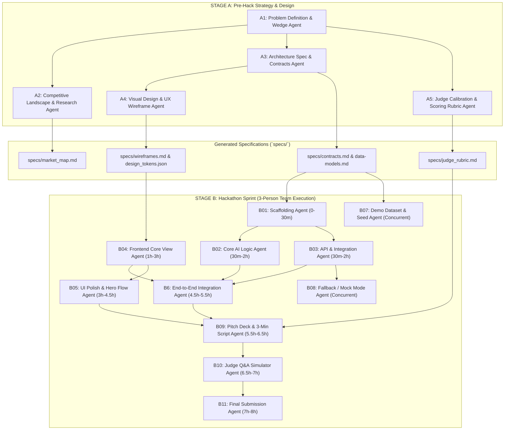

# 🗺️ Agent Map & Team Run Guide

## 1. Agent Workflow Architecture

---

## 2. 3-Person Team Run Guide

> **Pre-Flight Rule:** All agents (Claude Code, Cursor, Codex, OpenCode) must read and enforce `CLAUDE.md` / `CODEX.md` before generating code or installing packages. Zero extra requirement files, zero scratchpad trash.

| Agent | Stage | Primary Owner | Tool / Runner | Input Artifacts Needed | Output Produced | Cut If Over Time |
|---|---|---|---|---|---|---|
| **A1: Problem & Wedge** | A | All / Lead | Claude / ChatGPT | Raw idea notes | `specs/problem_wedge.md` | Non-negotiable |
| **A2: Research** | A | Member 3 (Biz/Pitch) | Perplexity / Claude | `problem_wedge.md` | `specs/market_map.md` | Deep stats (keep 1 key metric) |
| **A3: Architecture** | A | Member 1 (Backend) | Claude Code / Cursor | `problem_wedge.md` | `specs/contracts.md`, `schema.ts` | Microservices → monolithic script |
| **A4: Visual Design** | A | Member 2 (Frontend) | Claude / v0.dev | `problem_wedge.md` | UI Layouts & mock HTML/CSS | Complex charts/animations |
| **A5: Judge Calibration** | A | Member 3 (Biz/Pitch) | Claude / ChatGPT | Hackathon guidelines | `specs/judge_rubric.md` | Non-negotiable |
| **B01: Scaffolding** | B | Member 1 (Backend) | Terminal / Claude Code | `specs/contracts.md` | Working monorepo / boilerplate | Strict styling lint / CI rules |
| **B02: Core Logic / AI** | B | Member 1 (Backend) | Cursor / Claude Code | `specs/contracts.md` | Pure functions / model inference | Dynamic prompting / fine-tuning |
| **B03: API Endpoints** | B | Member 1 (Backend) | Cursor / Claude Code | `specs/contracts.md` | REST/RPC endpoints + auth stub | Complex auth / multi-tenancy |
| **B04: Frontend Core** | B | Member 2 (Frontend) | Cursor / v0 / Claude Code | `wireframes.md`, `contracts.md` | Working UI views | Sub-pages (keep single dashboard) |
| **B05: UI Polish** | B | Member 2 (Frontend) | Cursor / Claude Code | Frontend views + Seed data | Interactive hero flow + loaders | Dark mode, responsive mobile view |
| **B06: E2E Integration** | B | Member 1 + 2 | Claude Code | B2, B3, B4 outputs | Connected live end-to-end loop | Live LLM generation → canned seed |
| **B07: Demo Seed Data** | B | Member 3 (Biz/Pitch) | Claude / ChatGPT | `specs/contracts.md` | `seeds.json` realistic data | Dynamic generative seeds |
| **B08: Fallback / Mock** | B | Member 1 (Backend) | Claude Code | `specs/contracts.md` | Toggleable offline demo mode | None (Critical for live demo) |
| **B09: Pitch & Script** | B | Member 3 (Biz/Pitch) | Claude / ChatGPT | Live app walkthrough | 3-min script + 5 slide outlines | Extra team slides |
| **B10: Judge Q&A** | B | Member 3 + All | Claude / ChatGPT | `market_map.md`, pitch script | Top 10 hard Q&A cheat sheet | Practice rounds 2-3 |
| **B11: Final Submission**| B | Member 3 (Biz/Pitch) | Browser / Claude | Devpost / GitHub links | Complete README & submission | Video special effects |
