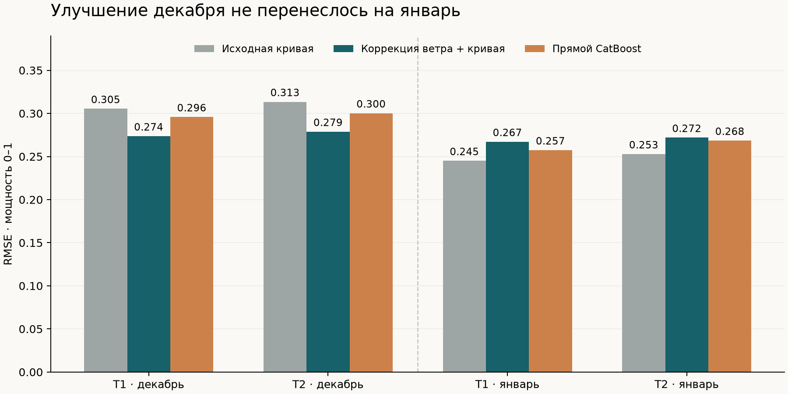

# Результат эксперимента GFS → мощность

**Обучение и сравнение завершены. Коррекция ветра выиграла на декабре, но
ухудшила январский результат. Рабочей оставлена исходная эмпирическая кривая.**
Экспериментальная модель и её февральские прогнозы сохранены отдельно.

## RMSE за 48 часов

Все числа относятся к нормированной мощности 0–1. Это не проценты ошибки.

| Модель | Декабрь · Т1 | Декабрь · Т2 | Январь · Т1 | Январь · Т2 |
|---|---:|---:|---:|---:|
| Исходная кривая | 0,3054 | 0,3135 | **0,2450** | **0,2528** |
| Коррекция ветра + кривая | **0,2736** | **0,2788** | 0,2671 | 0,2719 |
| Прямой CatBoost | 0,2958 | 0,3002 | 0,2574 | 0,2684 |



Коррекция улучшила декабрьский RMSE на **10,4% / 11,1%** по турбинам.
Она прошла все заранее заданные проверки: обе турбины, оба горизонта и обе
половины декабря. CatBoost улучшил общий декабрьский RMSE только на 3,1% / 4,2%
и ухудшил первую половину месяца; порог замены он не прошёл.

На дополнительной январской проверке коррекция увеличила RMSE на
**9,0% / 7,5%**, а MAE — с 0,1776 / 0,1819 до 0,2074 / 0,2108.
В ноябре–декабре GFS в среднем занижал ветер примерно на 1,5 м/с; в январе
смещение сократилось примерно до 0,5 м/с. Перенесённая поправка стала слишком
большой. Ошибки соединения временных рядов или реализации формул не обнаружены:
метрики, коэффициенты коррекции и сохранённые прогнозы проверены независимо.

## Решение о рабочей версии

Выбор алгоритма по декабрю сохранён без изменений в `decision.json`;
январские результаты не использовались для подбора параметров или другого
кандидата. **Автоматическая активация отложена** из-за январской регрессии.
Это явное отступление от запланированной автоматической замены после
декабрьского порога, зафиксированное в `release_decision.json`.

Финальная экспериментальная коррекция переобучена на доступных ноябрьских–январских
данных и зафиксирована до первого февральского выпуска. Такое переобучение
не доказывает устранение регрессии: февральских наблюдений нет.

## Данные и файлы

- 62 выпуска NOAA, 5 952 погодные строки. Все сроки публикации проверены.
- Обучение декабря: 1 344 прогнозных случая на турбину, 672 уникальных часа.
- Проверка декабря: 1 480 / 1 468 случаев; января: 1 464 / 1 464.
- [Декабрьские метрики](december/metrics.csv), [январские метрики](january_descriptive/metrics.csv).
- [Экспериментальный февраль, все 48-часовые выпуски](february_experimental/forecast_48h_long.csv): 2 784 строки.
- [Экспериментальный февраль на сутки вперёд](february_experimental/forecast_day_ahead_february.csv): 1 344 строки.
- [Проверка архива](archive_verification.json), [независимая проверка расчётов](independent_verification.json).

Рабочие файлы в `outputs/february/` сохранены. `active.json` не создавался;
приложение продолжает использовать исходную кривую. Для повторения отдельного
экспериментального прогноза:

```sh
.venv/bin/python scripts/replay_february.py \
  --model-manifest outputs/gfs_ml/deployment/manifest.json \
  --output-dir outputs/gfs_ml/february_experimental
```

Декабрь — выборка выбора модели. Январь уже использовался в предыдущем анализе
и является описательной проверкой. Независимого подтверждения февральской
точности нет. Этот короткий зимний пилот не устанавливает качество во все сезоны.
