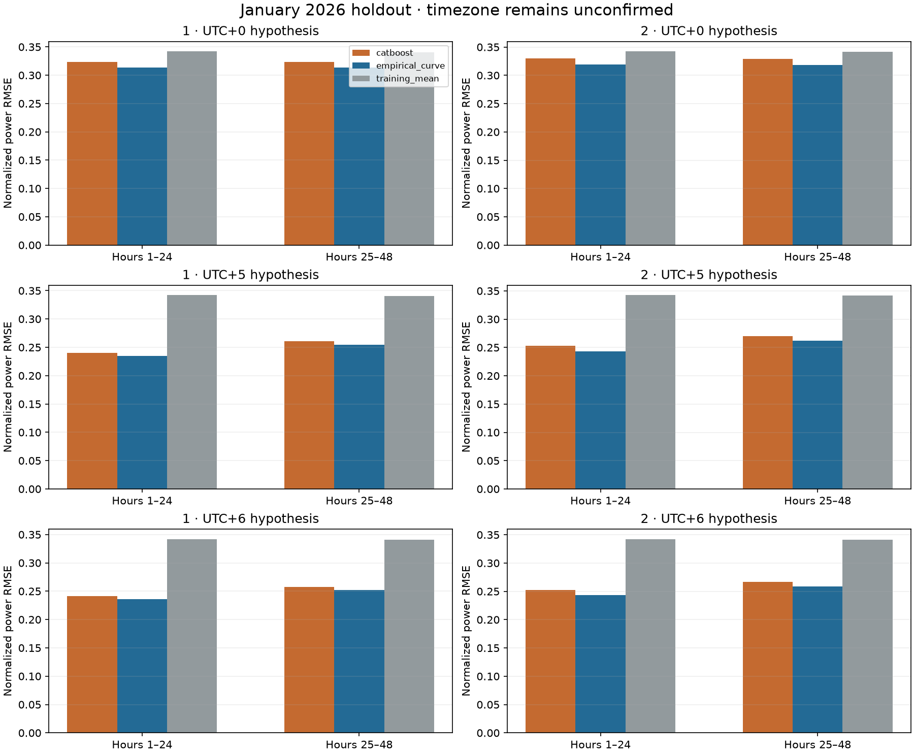
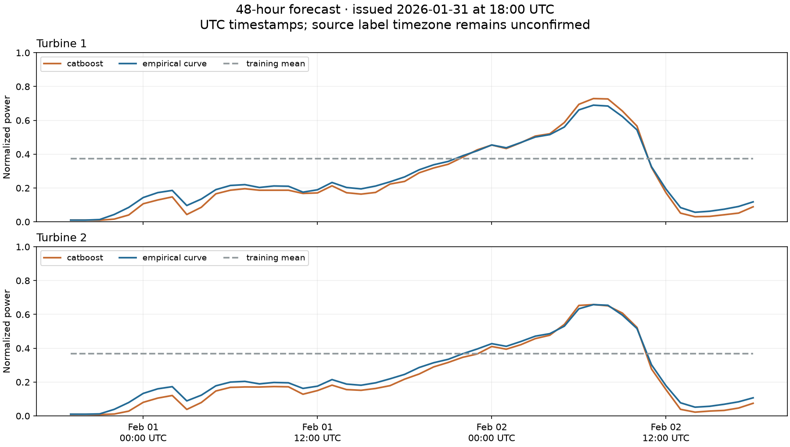

# Результаты базового прогноза ВЭС

Выполнены три шага: почасовая подготовка данных, загрузка настоящих архивных прогнозов NOAA и январское сравнение моделей. **Эмпирическая кривая дает меньший RMSE, чем CatBoost и постоянное среднее, у обеих турбин при всех трёх проверяемых гипотезах времени.** CatBoost иногда немного лучше по MAE; сложность модели сама по себе пока не дала устойчивого преимущества.

## Данные и протокол

- Почасовой датасет: 50,784 строк, из них 48,452 полных и 2,332 неполных часов. Пропуски сохранены; исходные CSV не изменены.
- В январе есть все 744 часа для каждой турбины. Фактических февральских значений в исходных CSV нет.
- Загружены 32 выпуска GFS: 31.12.2025–31.01.2026, запуск 12:00 UTC. Каждый даёт 48 прогнозных часов для обеих турбин: 3 072 погодные строки.
- Прогноз мощности выпускается в 18:00 UTC; используются GFS f007–f054. GRIB и индекс опубликованы до выпуска; наименьший запас публикации составил 117,6 минуты.
- Обучение зафиксировано до 31.12.2025 00:00 по исходным меткам: 22 899 часов турбины 1 и 24 017 часов турбины 2. Это исключает попадание будущих измерений в самый ранний прогноз при любой рассматриваемой гипотезе времени.
- Для январского прогноза используются только прогнозные ветер и температура. Наблюдения мощности января нужны лишь для оценки. Перекрывающиеся прогнозы разных выпусков считаются отдельными случаями.
- Метки исходного CSV пока трактуются как начало десятиминутного интервала. Часовой пояс и соглашение о метках должен подтвердить владелец данных.

## RMSE за все 48 часов

Числа относятся к мощности в шкале 0–1. Они не являются процентом относительной ошибки и не выражены в МВт.

| Гипотеза времени CSV | Турбина | Случаев | Постоянное среднее | Кривая | CatBoost |
|---|---:|---:|---:|---:|---:|
| UTC+0 | 1 | 1464 | 0.3417 | **0.3136** | 0.3232 |
| UTC+0 | 2 | 1464 | 0.3420 | **0.3190** | 0.3299 |
| UTC+5 | 1 | 1464 | 0.3416 | **0.2450** | 0.2501 |
| UTC+5 | 2 | 1464 | 0.3420 | **0.2528** | 0.2614 |
| UTC+6 | 1 | 1462 | 0.3416 | **0.2444** | 0.2492 |
| UTC+6 | 2 | 1462 | 0.3420 | **0.2510** | 0.2594 |

**Ни одна гипотеза времени не подтверждена этими метриками.** Качество может зависеть и от сдвига погодного прогноза; выбирать часовой пояс по меньшей ошибке нельзя. Число случаев различается из-за календарных границ января. Внутри каждой гипотезы все модели проверяются на одинаковых случаях.

## Первые и вторые сутки — пример для гипотезы UTC+5

UTC+5 приведён как отдельный сценарий. Все показатели для UTC+0/+5/+6 доступны в [metrics.csv](metrics.csv).

| Турбина | Горизонт | Случаев | MAE кривой | RMSE кривой | MAE CatBoost | RMSE CatBoost |
|---|---|---:|---:|---:|---:|---:|
| 1 | 1-24 ч | 744 | 0.1696 | 0.2351 | 0.1681 | 0.2398 |
| 1 | 25-48 ч | 720 | 0.1858 | 0.2549 | 0.1843 | 0.2604 |
| 2 | 1-24 ч | 744 | 0.1742 | 0.2435 | 0.1752 | 0.2526 |
| 2 | 25-48 ч | 720 | 0.1898 | 0.2621 | 0.1901 | 0.2703 |

При гипотезе UTC+5 кривая снижает RMSE относительно постоянного среднего на **28.3% / 26.1%** для турбин 1/2. Среднее смещение кривой составляет −0,053 / −0,061: мощность в среднем недооценена. Январь служит для сравнения вариантов; это не независимая оценка уже выбранной по январю модели.

## Прогноз на 48 часов

[forecast_48h_utc.csv](forecast_48h_utc.csv) содержит ровно 48 строк: время выпуска, целевое время UTC, горизонт и шесть колонок мощности — две турбины × три модели. Значения мощности ограничены 0–1.

Исторический демонстрационный выпуск: **31.01.2026 18:00 UTC**, целевые часы **31.01 19:00–02.02 18:00 UTC**. При гипотезе UTC+5 это 1–2 февраля по местному времени. Проверить его февральскую ошибку по предоставленным данным невозможно.

## Что ограничивает качество и что делать следующим

Кривая и CatBoost обучены на измеренном ветре у турбины, а применяются к прогнозу GFS на высоте 100 м. Высота ступицы не предоставлена. Ошибка погоды, пространственное сглаживание и возможные простои остаются внутри общей ошибки прогноза мощности. Январские данные не использованы для калибровки этого различия.

Следующий шаг для повышения качества: подтвердить время и метки CSV, затем собрать погодный архив за период до января и обучить модель непосредственно на парах «архивный прогноз GFS → последующая мощность». Проверку оставить на отдельном более позднем периоде. Эмпирическую кривую сохранить как контрольный вариант.

## Воспроизведение и проверки

Команды подготовки, загрузки и оценки: [README проекта](../../README.md). Выходные метрики и происхождение данных: [metrics.json](metrics.json).

Проверены агрегация и пропуски, границы обучения, доступность прогноза к моменту выпуска, извлечение GRIB, расчёт метрик и сериализация моделей. Исходные файлы сверены по SHA-256. Финальные результаты проверки: [verification.json](verification.json).

OpenAI и NVIDIA API на этом этапе не вызывались; API credits не использованы. Прогнозные модели обучены локально на CPU.
